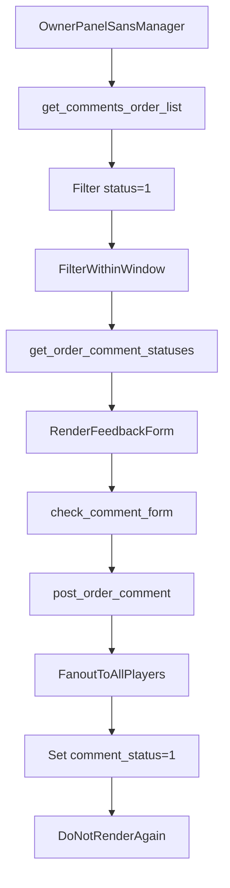

# Owner Feedback Module Specification

## Scope

This document specifies the `owner feedback` flow where a room owner/sans manager submits one immutable feedback entry for a running session order, and the system fans it out to all players in that order.

The feedback is **about players**, not about the game product itself.

## Business Goal

- Show feedback form only for eligible in-window active session orders.
- Allow owner to submit one comment + one vote (`like` / `dislike`) per order.
- Store feedback for all players in that order.
- Grant exactly 10 points to each player when vote is `like`.
- Never show this feedback section to regular customers/guests on profile.

## Authoritative Runtime Components

- `wp-content/themes/escapezoom-v2/woocommerce/myaccount/pages/sans-manager.php`
- `wp-content/themes/escapezoom-v2/app/ajax/callbacks/get_comments_order_list.php`
- `wp-content/themes/escapezoom-v2/app/ajax/callbacks/get_order_comment_statuses.php`
- `wp-content/themes/escapezoom-v2/app/ajax/callbacks/check_comment_form.php`
- `wp-content/themes/escapezoom-v2/app/ajax/callbacks/post_order_comment.php`
- `wp-content/themes/escapezoom-v2/app/functions/helper/owner_feedback.php`
- `wp-content/themes/escapezoom-v2/profile.php`
- `wp-content/themes/escapezoom-v2/app/functions/helper/add-point.php`

## Domain Rules

### Eligibility Window

Feedback form is eligible only within:

- `window_start = session_start + 30m`
- `window_end = session_start + session_duration + 30m`
- Inclusive boundaries: `now >= window_start && now <= window_end`

Source of truth:

1. Order start time:
   - `postmeta.sans_time` (primary)
   - `wp_zb_booking_history.booking_time` fallback
2. Room duration:
   - `postmeta.room_duration` (primary)
   - `products_data.duration` fallback

### Booking Status Gate

In `wp_zb_booking_history`:

- `status = 1` => valid active-booking candidate for feedback list
- `status = 2` => session closed by owner, feedback form must not be shown

Any row outside `status = 1` must be excluded from the form list.

### Single Submission per Order

After successful submission:

- `comment_status` of order is set to `1`
- order should no longer render feedback form
- editing is not supported

### Fan-out Target Audience

Feedback fan-out must include all users resolved from:

1. `wp_markting.order_phones`
2. order meta `players_phone`
3. order leader (`_customer_user` and `_billing_phone`)

All resolved user IDs are deduplicated before write operations.

### Vote Effects

- `like`:
  - append feedback payload for each target user in `usermeta.owners_feedback`
  - increment `owners_like`
  - add `owner_satisfaction` point (`10`) exactly once per `(user_id, order_id)`
- `dislike`:
  - append feedback payload for each target user in `usermeta.owners_feedback`
  - increment `owners_dislike`
  - no points granted

### User Provisioning for Teammates

If teammate user does not exist:

- create user using normalized last-10 digits as login
- ensure `customer` role
- if human name is missing, set fallback display identity:
  - `کاربر اسکیپ زوم {user_id}`

For existing users, do not overwrite meaningful human names.

## Data Model

### Order Meta

- `comment_status` => binary completion marker (`1` means submitted)
- `_owner_feedback_submitted` => state container (`processing|failed|completed`)
- `_owner_feedback_progress` => checkpoint for resumable processing

### User Meta

- `owners_feedback` => array of payload objects:
  - `room_id`
  - `order_id`
  - `owner_comment`
  - `vote`
  - `owner_user_id`
  - `created_at`
- `owners_like` => integer counter
- `owners_dislike` => integer counter
- `_owner_feedback_vote_counted_{order_id}` => vote lock
- `_owner_satisfaction_order_{order_id}` => point lock

### Points Table

Point type defined in code:

- type key: `owner_satisfaction`
- point: `10`
- action: `رضایت مجموعه دار`
- runtime description should include order reference:
  - `رضایت مجموعه دار - سفارش {order_id}`

## Security Model

All sensitive callbacks are routed via `v2_ajax_handler` with nonce checks.

Server-side validations:

- authenticated user required
- room/order consistency check
- owner authorization (`user_ebtal` or `sans_manager`) or admin capability
- time-window validation
- payload sanitization for all inputs

## API Contracts

### `get_comments_order_list`

Input:

- list of room IDs (`product_id[]`) from owner panel active products

Output:

- array of eligible orders with presentation fields for the form

Hard filters:

- requester must own target room (or be admin)
- booking row `status` must be `1`
- order must be within feedback window
- order should be unique in response
- name emptiness must not exclude order (fallback name is acceptable)

### `get_order_comment_statuses`

Input:

- candidate order rows from previous step

Output:

- either full form payload for orders without feedback
- or minimal marker `{ has_comment: true, order_id }`

### `check_comment_form`

Purpose:

- pre-submit gate to prevent stale/late form submissions

Validation:

- auth + owner authorization
- room/order mapping
- time-window check

### `post_order_comment`

Purpose:

- perform immutable submit flow, fan-out writes, vote counters, optional points

Returns:

- `success`, `partial_recovered`, `already_completed`, `in_progress`, or error statuses

## Runtime Flow

## Error Handling and Idempotency

- Order-level state lock prevents concurrent double-processing.
- User-level locks prevent duplicate vote count increments.
- User-level locks prevent duplicate point grants for same order.
- Recoverable failures keep progress state for safe retry.

## Visibility Rules on Player Profile

Owner feedback block appears only when:

- target player has `owners_feedback` data
- viewer role is `compiler` or `administrator`

It must stay hidden for:

- regular customers
- non-authenticated users

## Edge Case Decisions

1. Booking `name` empty:
   - still eligible for form if all other constraints pass
2. Multiple booking rows for same order:
   - deduplicate by `order_id`
3. Session closed by owner:
   - `status = 2` row excluded from form list
4. Invalid teammate phone:
   - skip user with reason, continue processing others

## Non-Goals

- No owner feedback editing after submit
- No multi-submit for same order
- No public exposure of owner feedback to non-privileged viewers

## Blueprint for Future Reimplementation (Without WooCommerce)

When rebuilding from scratch, keep behavior but simplify storage boundaries:

1. Introduce `sessions` table:
   - `id`, `room_id`, `start_time`, `duration_min`, `status`, `owner_id`
2. Introduce `session_players` table:
   - `session_id`, `user_id`, `phone`, `display_name_snapshot`
3. Introduce immutable `owner_feedback` table:
   - `session_id`, `submitted_by`, `vote`, `comment`, `created_at`
4. Introduce `owner_feedback_targets` table:
   - `feedback_id`, `user_id` for fan-out join clarity
5. Preserve points idempotency using unique index:
   - `(user_id, action, reference_order_id)`
6. Expose service-level API:
   - `GET /owner-feedback/eligible-sessions`
   - `POST /owner-feedback/submit`
7. Keep role-gated projection for player profile visibility.

## Acceptance Checklist

- form shows only for in-window and `status=1` sessions
- form does not show for `status=2` sessions
- empty booking name does not hide eligible order
- submit writes feedback for all team members
- like grants exactly 10 points once per player per order
- dislike grants zero points
- `comment_status=1` blocks future form rendering for same order
- profile visibility remains restricted to privileged roles
