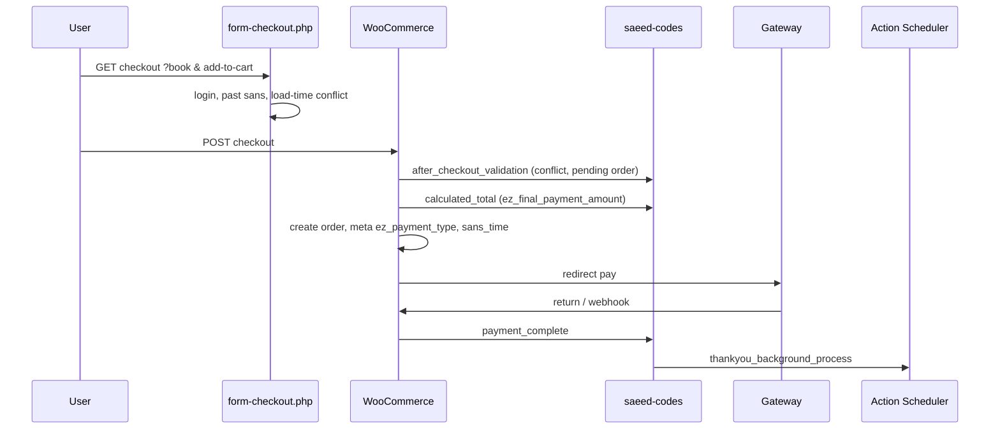

# Module: Checkout & payment (WooCommerce path)

> **Principles:** `docs/.cursor/rules/05-business-domain-principles.mdc`  
> **Slot integrity:** [booking.md](./booking.md) — locks, conflicts, `wp_zb_booking_history`  
> **Post-pay settlement / commission detail:** `finance.md` (to write) — `calculate_and_update_order_financials`, `wp_markting`

## Goal

Take a user from **checkout page load** through **order creation**, **gateway payment** (Zarinpal / Zibal), and **return from bank** to **thankyou / booking pipeline** — with correct **payable amount** (prepay vs full), **no double booking**, and **auditable** financial side effects (Rule 03).

Must remain **behavior-compatible** during migration (Rule 01). No big-bang on this path.

## Scope

| In scope | Out of scope (other docs) |
|----------|---------------------------|
| Checkout URL (`book`, `add-to-cart`, quantity) | Sans lock TTL mechanics → [booking.md](./booking.md) |
| `ez_final_payment_amount` / cart total | Commission waterfall formulas → `finance.md` |
| `ez_payment_type` partial vs complete | Owner wallet credit after play → `wallet.md` |
| Coupon (single), wallet balance at checkout | Points accrual → `points.md` |
| Gateway select + verify (Zarinpal, Zibal) | Cancel/refund after order → `cancel.md` |
| `conflict_before_place_order_validation` | Auth / OTP → `auth.md` |
| `thankyou_background_process` enqueue | |
| `wp_checkout_intent` (CRM) | |

## Boundary with Booking

| Concern | Owner |
|---------|--------|
| Lock acquire/release, `get_sans_lock` | **Booking** |
| Conflict at **page load** (`form-checkout.php` SQL) | Legacy booking + should move to **ConflictDetector** |
| Conflict at **submit** (`conflict_before_place_order_validation`) | **Checkout orchestration** calls **Booking** services |
| Payable amount, gateway, order meta | **Checkout / Payment** |

## Legacy sources (read before changing)

### Theme — checkout & amounts

| File / symbol | Role |
|---------------|------|
| `woocommerce/checkout/form-checkout.php` | Login gate, past-sans check, **load-time** conflict via `ez_reservation` + `wp_zb_booking_history` |
| `inc/saeed-codes.php` → `ez_final_payment_amount` | `woocommerce_calculated_total` — **online amount** from sans price, prepay/full, coupon, wallet |
| `inc/saeed-codes.php` → `store_ez_payment_method` | Persists `ez_payment_type` order meta |
| `inc/saeed-codes.php` → `conflict_before_place_order_validation` | `woocommerce_after_checkout_validation` — submit-time guards |
| `inc/saeed-codes.php` → `disable_multiple_coupons` | Single coupon policy |
| `inc/saeed-codes.php` → `switch_zarinpal_gateway_by_domain` | Gateway list by host |
| `inc/saeed-codes.php` → `my_change_status_function` | `woocommerce_payment_complete` — status rewrite + snapshot |
| `inc/saeed-codes.php` → `ez_run_thankyou_booking_pipeline` | `thankyou_background_process` — booking + wallet pipeline |
| `inc/checkout-intent.php` | `wp_checkout_intent` CRM table, intent token, resume URL |
| `inc/ez-zibal-verify.php` | Action-based Zibal verify/inquiry, 30s verify lock meta |
| `functions.php` | Fallback if AS thankyou job missing |

### WooCommerce hooks (inventory)

See `docs/md/step1-freeze-map-bridge-report.md` §1 — including:

- `woocommerce_calculated_total` → `ez_final_payment_amount`
- `woocommerce_checkout_update_order_meta` → `store_ez_payment_method`
- `woocommerce_after_checkout_validation` → `conflict_before_place_order_validation`
- `woocommerce_payment_complete` → `my_change_status_function`
- `woocommerce_order_status_changed` → thankyou enqueue + `if_order_status_changed` (refund path)

### Analysis (read-only)

- `docs/md/تحلیل_فرآیند_چک_اوت_و_بازگشت_از_بانک.md` — step-by-step legacy flow + race at load vs submit
- `docs/md/step1-freeze-map-bridge-report.md` — ownership map, web-service matrix, risks R1–R3
- `docs/md/ANALYSIS_calculate_and_update_order_financials.md` — **after payment** marketing/wallet row (`wp_markting`) — not checkout UI

### Web-service (payment-adjacent)

| Type | Role |
|------|------|
| `update_product_discount_data` | Discount data affecting price path |
| `query_execution` | Still used from booking/checkout bridges — **ban new uses** |

## Legacy flow (summary)



### Stage notes

1. **Entry** — Guest must login (`panel?redirect=…`). `book` = Unix sans time.
2. **Load-time conflict** — SQL on `wp_zb_booking_history` via `ez_reservation` — **not repeated on submit** in old path alone (gap).
3. **Submit validation** — `conflict_before_place_order_validation`: booking_details parse, pending same-slot order, owner-blocked slot, confirmed conflict, **get_sans_lock** locks held by others.
4. **Amount** — See § Amount logic (not Woo base price).
5. **Pay** — Zarinpal (domain-selected) or Zibal; verify layers in theme.
6. **After pay** — Pipeline job; financials via `wp_markting` / wallet — see `finance.md`.

## Amount logic (legacy — target: `AmountCalculator`)

**Hook:** `woocommerce_calculated_total` → `ez_final_payment_amount($total, $cart)`.

| Input | Source |
|-------|--------|
| Sans time | `ez_get_booking_time_for_checkout()` / session / POST |
| Base price | Product sans grid (`get_sanses`), `off_price` or `price` for matching time |
| Special discount | `special_discount_*` post meta if enabled + in date |
| Quantity | Cart line qty |
| Payment mode | `ez_payment_type`: `partial` (default) vs `complete` |
| Prepay multiplier | `pish_pardakht_per_person` post meta (tickets charged online for partial) |
| Coupon | `ez_get_coupon_discount_amount` — **one coupon** (policy hook) |
| User level discount | Only specific test user IDs in legacy — replace with real tier rules in core |
| Wallet | `wldb->get_balance` — reduces payable; can zero out gateway amount |

**Rules (business):**

- **Partial:** online charge = `asli * pish_pardakht_per_person` (not full cart line total).
- **Complete:** online charge = full line total (after product-level discounts).
- Coupons apply against **amount_to_pay**, not silently against unrelated totals.
- **Owner vs platform discount** for display/settlement — separate in `finance.md`; checkout only computes **customer payable now**.

**Target:** `EscapeZoom\Core\Modules\Payment\Services\AmountCalculator` — pure function + tests; theme filter calls adapter.

## Payment method meta

- **POST:** `ez_payment_type` = `partial` | `complete`
- **Stored:** order meta via `store_ez_payment_method`
- Used downstream by pipeline and `wp_markting.order_payment_type`

## Gateway & verify

| Piece | Legacy | Target |
|-------|--------|--------|
| Gateway list | `switch_zarinpal_gateway_by_domain` | `GatewaySelector` |
| Zarinpal verify / poll | `verify_zarinpal_payment`, crons `zarinpal_paid_transactions_process*` | `PaymentVerifier`, Queue pollers |
| Zibal | `inc/ez-zibal-verify.php`, option `ez_zibal_action_based_enabled` | Same module; **30s verify lock** on order meta — prevent double verify |

**Rule 03:** Gateway HTTP verify/refund — not in 2s front timeout; idempotent verify.

## Checkout intent (CRM)

- Table `wp_checkout_intent` (Medoo CRM DB) — optional supersede guest sessions.
- Token: `hash(user|product|sans_ts|woo_customer_session)`.
- Cleared when order placed — see `inc/checkout-intent.php`.
- **Target:** track abandoned checkout without storing transactional rules in `wp_options`.

## New flow (target core)

```
CheckoutAdapter (theme/WC hooks)
  → CheckoutOrchestrator
      → BookingConflictService (submit + idempotent)
      → AmountCalculator
      → CheckoutMetaWriter (ez_payment_type, sans_time, players)
  → GatewaySelector → WC payment
  → PaymentVerifier (async-safe, locked)
  → OrderStatusTransitionService
  → enqueue BookingPipelineJob (was thankyou_background_process)
```

- **No new** `admin-ajax` or `web-service.php` endpoints for checkout (Rules 02–03).
- **Re-run conflict** inside orchestrator at submit (fix load-only race).

## Migration (Rule 01)

Suggested flags: `EZ_CHECKOUT_*`, `EZ_PAYMENT_*`

| Phase | Checkout / payment |
|-------|-------------------|
| **1 – Expand** | Amount + meta written to new store; WC still authoritative for order id |
| **2 – Backfill** | Reconcile `wp_markting` / order meta vs new ledger; merged read for amounts on reports |
| **3 – Decommission** | Remove `ez_final_payment_amount` body from theme; filters call core only |

**Red lines (Rule 01 + 03):**

- No big-bang switch of gateway or total calculation on production peak.
- No dropping `woocommerce_calculated_total` bridge until parity on sampled orders (amount + status + booking row).
- Financial mutations → audit log.

Rollout (when started): `escapezoom-core/docs/rollout/checkout-payment-cutover.md`

## Target core services (from step1 map)

| Legacy | Core |
|--------|------|
| `ez_final_payment_amount` | `AmountCalculator` |
| `store_ez_payment_method` | `CheckoutMetaWriter` |
| `ez_get_coupon_discount_amount` | `CouponDiscountCalculator` |
| `disable_multiple_coupons` | `CouponPolicyService` |
| `switch_zarinpal_gateway_by_domain` | `GatewaySelector` |
| `verify_zarinpal_*` | `PaymentVerifier` / pollers |
| `conflict_before_place_order_validation` | `CheckoutOrchestrator` + `ConflictDetector` |
| `my_change_status_function` | `OrderStatusTransitionService` |
| `ez_run_thankyou_booking_pipeline` | `BookingPipelineJob` |

## API surface (future)

- **Web v3:** HTMX checkout fragments → signed gateway (not legacy checkout AJAX).
- **Mobile:** REST checkout session after Auth — **same** `AmountCalculator` + conflict services; no duplicate formulas in RN.

## Tests (Rule 04 — Pest)

| Suite | Cases |
|-------|--------|
| **Unit** | `AmountCalculator`: partial vs complete, coupon cap, wallet zeroing, special discount |
| **Unit** | `CouponPolicyService`: reject second coupon |
| **Unit** | `CheckoutOrchestrator`: conflict at submit when load-time check would pass |
| **Integration** | Pending same-slot order blocks second checkout |
| **Integration** | Zibal verify lock — second verify rejected within 30s |
| **Parity** | Sample legacy orders: `ez_final_payment_amount` vs core for same cart fixture |

## Edge cases & known issues

1. **Race:** conflict on GET in `form-checkout.php` but full submit checks in `conflict_before_place_order_validation` — new core must keep **submit** as source of truth.
2. **Pending order same slot** — reuse payment URL or block second order (resolver functions in validation).
3. **Same viewer already booked** — distinct error message vs “other person booked”.
4. **Owner-blocked slot** — `ez_booking_slot_closed_by_owner`.
5. **Locks by others** — `get_sans_lock` JSON in validation (see booking.md).
6. **User level discount** — hard-coded user IDs in legacy; replace with tier service before production reliance.
7. **thankyou_background_process** — must stay idempotent (`booking_pipeline_done_at`); monitor AS queue (see theme `bin/verify-action-scheduler-health.php`).
8. **Financials** — `calculate_and_update_order_financials` runs in pipeline context, reads `wp_markting` — document in `finance.md`, not duplicated here.

## Related modules

- [booking.md](./booking.md) — locks, sans conflict, reservation tables
- `finance.md` — commission, `wp_markting`, `calculate_and_update_order_financials` (to write)
- `wallet.md` — balance at checkout vs settlement (to write)
- `cancel.md` — `if_order_status_changed` refund path (to write)

## Changelog

| Date | Change |
|------|--------|
| 2026-05-24 | Initial module doc from step1 freeze-map, checkout analysis, saeed-codes / checkout-intent / zibal verify |
