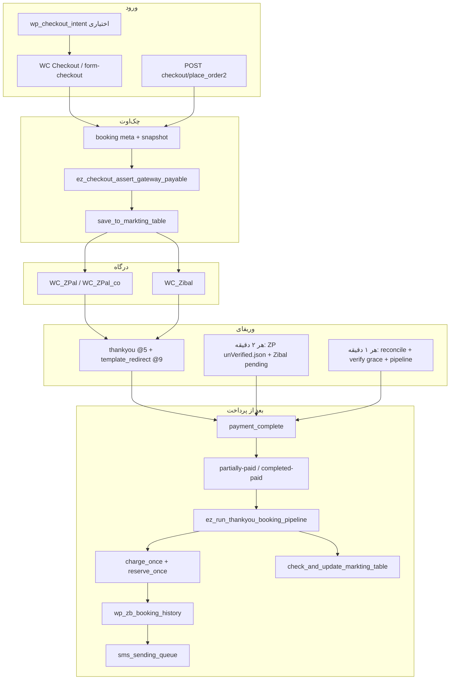
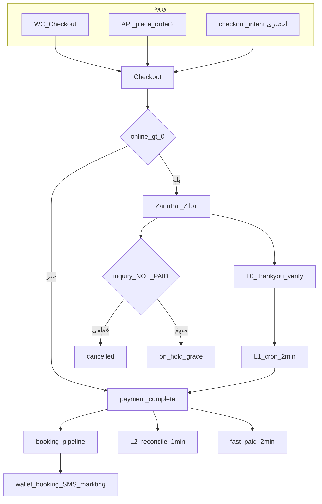
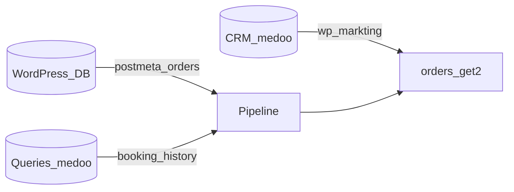

# معماری سفارش، پرداخت، کیف پول و وریفای — EscapeZoom v2

**نسخه سند:** 2.2 (مهاجرت + عملیات + بیزینس)  
**هم‌ترازی با کد:** `new_project/escapezoom-v2` — پس از heal stuck processing، finalize-before-SMS، `ez_heal_post_booking_order_integrity`  
**مخاطب:** توسعه‌دهنده مهاجرت، حسابداری/پشتیبانی، مدیر فنی

### Changelog (doc)

- **2.2:** stuck `wc-processing` با بوکینگ موفق — `ez_heal_post_booking_order_integrity`، finalize قبل از SMS، `bin/ez-heal-stuck-processing-orders.php`، reconcile skip exception برای processing+booking
- افزودن خلاصه اجرایی، توپولوژی ۳ DB، وضعیت‌های بیزینسی، پنل تیم (نقش/eligibility)، سناریوهای عملیاتی، checklist sign-off
- تصحیح ادعاهای مستندات غیررسمی (Grok): throttle `_ez_last_verify_attempt`، ستون‌های `payment_details`/`expected_online`، ۳ cron، امضای `ez_wallet_charge_exists_for_order`
- جدول ۴ cron، پنجره skip reconcile paid (۱–۱۰ دقیقه)، ستون‌های واقعی `wp_markting`
- تست استاتیک: **61 pass** (`bin/qa-verify-order.php --static`)

---

## خلاصه اجرایی

| اصل | خلاصه |
|-----|--------|
| گارد ۰ تومان | سفارشی که آنلاین باید بپردازد ولی `get_total()<=0` به درگاه نمی‌رود |
| wallet-only | مسیر جدا؛ snapshot در چک‌اوت، تسویه بعد از `payment_complete` |
| کیف پول | شارژ `player_charge:*` سپس رزرو `player_reserve:*`؛ فقط `unique_description` |
| وریفای | L0 thankyou + cron ۲د (ZP unVerified + Zibal) + reconcile ۱د + fast-paid ۲د |
| pipeline | `ez_run_thankyou_booking_pipeline` — idempotent؛ thankyou فقط UI |
| لغو درگاه | فقط وقتی inquiry قطعی NOT PAID؛ وگرنه `on-hold` + grace verify |

**ورود اصلی:** چک‌اوت WooCommerce + API `place_order2`. `wp_checkout_intent` **اختیاری** (URL تمیز).

**۴ cron مالی/سانس:**

| Interval | Hook | هدف |
|----------|------|-----|
| ۲ دقیقه | `zarinpal_*_paid_transactions_process_cron` | ZP unVerified.json (main + co) |
| ۲ دقیقه | `zibal_unverified_orders_process_cron` | Zibal pending + trackId |
| ۲ دقیقه | `ez_fast_paid_missing_booking_cron` | paid بدون booking (۱–۶۰ دقیقه) |
| ۱ دقیقه | `ez_wp_markting_wc_reconcile_booking_cron` | pending ۱–۶۰د + paid-stuck + pipeline |

جزئیات: [§۶](#۶-وریفای-پرداخت)، [§۲۰](#۲۰-پنل-تیم-عملیاتی)، [§۲۲](#۲۲-business-sign-off-checklist).

---

## فهرست

1. [اهداف و اصول](#۱-اهداف-و-اصول-طراحی)
2. [معماری کلی](#۲-معماری-کلی)
3. [نقشه فایل‌ها](#۳-نقشه-فایل‌ها)
4. [ورودی‌ها: وب، API، Intent](#۴-ورودی‌ها)
5. [چک‌اوت تا درگاه](#۵-چک‌اوت-تا-درگاه)
6. [وریفای پرداخت](#۶-وریفای-پرداخت)
7. [payment_complete و تغییر وضعیت](#۷-payment_complete)
8. [Pipeline رزرو سانس](#۸-pipeline-رزرو-سانس)
9. [کیف پول بازیکن](#۹-کیف-پول-بازیکن)
10. [wp_markting و reconcile](#۱۰-wp_markting)
11. [SMS](#۱۱-sms)
12. [متاهای کامل](#۱۲-متاهای-کامل)
13. [حالت‌های خطا](#۱۳-حالت‌های-خطا)
14. [چک‌لیست مهاجرت](#۱۴-چک‌لیست-مهاجرت)
15. [لاگ و دیباگ](#۱۵-لاگ-و-دیباگ)
16. [رفع سفارش آسیب‌دیده](#۱۶-رفع-سفارش-آسیب‌دیده)
17. [اشتباهات رایج در مستندات غیررسمی](#۱۷-اشتباهات-رایج)
18. [توپولوژی دیتابیس](#۱۸-توپولوژی-دیتابیس)
19. [وضعیت‌ها و مبالغ بیزینسی](#۱۹-وضعیت‌ها-و-مبالغ-بیزینسی)
20. [پنل تیم عملیاتی](#۲۰-پنل-تیم-عملیاتی)
21. [سناریوهای عملیاتی](#۲۱-سناریوهای-عملیاتی)
22. [Business Sign-off checklist](#۲۲-business-sign-off-checklist)

---

## ۱. اهداف و اصول طراحی

| اصل | پیاده‌سازی در کد |
|-----|------------------|
| سفارش با **۰ تومان آنلاین** به درگاه نرود | `ez_checkout_assert_gateway_payable` + همان چک در `Escapezoom_Checkout::process_checkout` |
| مسیر **wallet-only** جدا است | وقتی `needs_payment()` false یا total=0 با کیف پوشانده شده → `process_order_without_payment` / بدون redirect درگاه |
| کیف پول **منفی نشود** | شارژ با `player_charge:*` قبل از رزرو؛ گارد `on-hold-missing-wallet-charge` اگر درگاه + online>0 ولی شارژ نباشد |
| Idempotency شارژ/رزرو | فقط `wallet_transactions.unique_description` |
| Legacy شارژ حذف شده | `ez_wallet_legacy_charge_exists` دیگر وجود ندارد |
| Thankyou فقط UI | `woocommerce/checkout/thankyou.php` — pipeline از template صدا زده **نمی‌شود** |
| Pipeline idempotent | `booking_pipeline_done_at` + `_ez_wallet_*` + unique DB |

**طراحی مهم:** شارژ/رزرو کیف پول در **checkout انجام نمی‌شود**؛ فقط snapshot ذخیره می‌شود. تسویه در `ez_run_thankyou_booking_pipeline` → `ez_player_wallet_apply_for_order`.

---

## ۲. معماری کلی



### ۲.۱ نمودار ساده‌شده (برای بیزینس)

> `wp_checkout_intent` اختیاری است؛ مسیر اصلی Web/API مستقیم به چک‌اوت می‌رود.



---

## ۳. نقشه فایل‌ها

| فایل | مسئولیت |
|------|---------|
| `functions.php` | لود ماژول‌ها؛ هوک checkout/payment؛ `ez_wp_markting_wc_reconcile_booking_cron`؛ `ez_reconcile_single_order_wp_markting_wc_booking` |
| `inc/checkout-booking-meta.php` | snapshot، گارد درگاه، lock pipeline، refund formula، logging |
| `inc/player-wallet-settle.php` | مبالغ آنلاین/prepaid/wallet_share؛ شارژ/رزرو؛ emergency settle |
| `inc/saeed-codes.php` | cart total؛ pipeline؛ conflict؛ SMS bundle؛ ZarinPal verify/cron؛ wallet step meta |
| `inc/ez-zibal-verify.php` | Zibal inquiry/verify؛ cron unverified؛ fail-return recovery |
| `inc/wp-markting-persistence.php` | `ez_markting_upsert_from_order` |
| `inc/ez-booking-checkout-validation.php` | اعتبارسانس checkout/API؛ `ez_gateway_handle_payment_return_failure`؛ پیام ineligible تیم |
| `inc/ez-markting-team-ops.php` | eligibility دکمه‌های پنل؛ prefetch booking؛ bad-order candidate |
| `inc/checkout-intent.php` | جدول اختیاری `wp_checkout_intent` (CRM) |
| `inc/api/callbacks.php` | `checkout_place_order_api2` |
| `inc/api/helper-functions.php` | `Escapezoom_Checkout` |
| `template/team/ajax/callbacks/orders_get2.php` | لیست سفارشات CRM؛ رندر دکمه‌ها؛ `$ez_orders_get2_list_context` |
| `template/team/ajax/callbacks/orders_actions.php` | AJAX `confirm_verified_payment` / `recover_booking_sans` |
| `woocommerce/checkout/thankyou.php` | render-only |
| `bin/qa-verify-order.php` | تست استاتیک (۵۴ pass) |
| `bin/test-team-ops-eligibility.php` | تست eligibility دکمه‌های تیم |
| `bin/ez-cron-health.php` | heartbeat `ez_reconcile_cron_last_run` |
| `bin/e2e-checkout-matrix.txt` | سناریوهای دستی staging |
| `bin/wallet-idempotency-notes.txt` | یادداشت عملیاتی کیف پول |
| `bin/wallet-unique-description-index.sql` | UNIQUE روی `unique_description` |

**خارج از تم (الزامی):** پلاگین‌های `WC_ZPal`، `WC_ZPal_co`، `WC_Zibal`؛ `ZarinpalHelperClass`؛ `EZ_Transaction_CRUD`؛ جداول DB.

---

## ۴. ورودی‌ها

### ۴.۱ چک‌اوت وب (WooCommerce)

- UI: `woocommerce/checkout/form-checkout.php` — `ez_payment_type` (`partial` / `complete`)، `booking_details`
- جمع سبد: فیلتر `woocommerce_calculated_total` → `ez_final_payment_amount` (priority **10** در `saeed-codes.php`)
- ثبت سفارش: `Escapezoom_Checkout::process_checkout()` در `inc/api/helper-functions.php`

### ۴.۲ API

| Route | Handler | یادداشت |
|-------|---------|---------|
| `POST /checkout/place_order` | `checkout_place_order_api` | legacy |
| `POST /checkout/place_order2` | `checkout_place_order_api2` | **اصلی:** `wc_create_order`، meta، `save_to_markting_table`، `payment_url` |
| `POST /checkout/thankyou` | `checkout_thankyou_api` | وضعیت بعد از پرداخت |

**هشدار مهاجرت:** مسیر API ممکن است هوک‌های `woocommerce_checkout_order_processed` را کامل اجرا نکند — متاهای `sans_time`، snapshot و `ez_payment_type` باید صریح ست شوند.

### ۴.۳ `wp_checkout_intent` (اختیاری)

- فایل: `inc/checkout-intent.php`
- جدول CRM: `wp_checkout_intent` (DDL در `escapezoom_ddl_manual_2026.sql` بخش ۴)
- نقش: URL تمیز `/checkout/{token}` — **کل سیستم نیست**؛ ردیف هنگام ثبت سفارش حذف می‌شود
- هوک: `woocommerce_before_checkout_form` (capture)، `checkout_order_processed` / `payment_complete` (remove)

---

## ۵. چک‌اوت تا درگاه

### ۵.۱ ترتیب هوک‌ها

| Hook | Priority | Callback | فایل |
|------|----------|----------|------|
| `woocommerce_checkout_update_order_meta` | **4** | `ez_checkout_update_order_booking_meta` | `functions.php` |
| `woocommerce_checkout_order_processed` | **11** | `save_to_markting_table` | `functions.php` |
| همان | **12** | `ez_checkout_capture_wallet_and_totals_snapshot` | `functions.php` |
| همان | **20** | `ez_checkout_assert_markting_before_gateway` | `functions.php` |
| همان | **21** | `ez_checkout_assert_gateway_payable` | `functions.php` |
| `woocommerce_checkout_order_processed` | **50** | `ez_remove_checkout_intents_for_order` | `checkout-intent.php` |
| همان | **100** | `checkout_init_tracking` | `functions.php` |

### ۵.۲ Snapshot (`ez_checkout_capture_wallet_and_totals_snapshot`)

منطق در `inc/checkout-booking-meta.php`:

```
online = max(0, (int) order->get_total())   // مبلغ قابل پرداخت آنلاین در لحظه چک‌اوت

اگر online > 0:
  ذخیره _ez_checkout_snapshot_online_payable = online
وگرنه:
  حذف meta (نه ذخیره 0)

+ _ez_checkout_snapshot_wallet_applied
+ _ez_checkout_snapshot_wallet_share
+ _ez_checkout_snapshot_prepaid
+ _ez_checkout_snapshot_captured_at
```

**فرمول wallet_share در snapshot:**

```
wallet_share = max(0, prepaid - (online + coupon_amount + user_level_discount))
```

### ۵.۳ گارد ۰ تومان (۳ لایه)

1. **`ez_checkout_assert_gateway_payable`** — اگر `needs_payment()` و `get_total() <= 0` → `ez_abort_checkout_order_marketing_failure('gateway_zero_payable_anomaly')`
2. **`Escapezoom_Checkout::process_checkout`** — همان شرط قبل از `process_order_payment`
3. **فیلتر cart** — می‌تواند `amount_to_pay = 0` برای wallet-only معتبر کند؛ گارد بالا فقط وقتی WC هنوز `needs_payment` است خطا می‌دهد

**تفاوت با `ez_order_online_paid_amount`:** گارد درگاه از **`get_total()`** استفاده می‌کند، نه از snapshot — تا سفارشی که snapshot=0 ولی total>0 اشتباه wallet-only نشود.

### ۵.۴ بعد از چک‌اوت

- Redirect به `order->get_checkout_payment_url()` (ZarinPal/Zibal)
- پلاگین درگاه: `authority` / `trackId` در postmeta

---

## ۶. وریفای پرداخت

> **تصحیح نسبت به مستندات غیررسمی (مثلاً Grok):** لایه «هر ۵ دقیقه / ۳۰ سفارش»، `_ez_last_verify_attempt`، و `too_old` در **مسیر verify production تم وجود ندارند** (فقط در صفحات تست خوانده می‌شود). Concurrency واقعی: `_ez_zp_verify_lock` / `_ez_zibal_verify_lock` (۳۰ ثانیه).

### ۶.۰ نمای کلی لایه‌ها و cronها

| لایه | زمان | منبع | نقش |
|------|------|------|-----|
| L0 | realtime | `woocommerce_thankyou` @5، `template_redirect` @9 | ۱–۳ retry بلافاصله |
| L1 | هر ۲ دقیقه | ZP `unVerified.json` (main+co) + Zibal pending DB | safety net verify |
| L2a | هر ۲ دقیقه | `ez_fast_paid_missing_booking_cron` | paid بدون booking (۱–۶۰ دقیقه) |
| L2b | هر ۱ دقیقه | `ez_wp_markting_wc_reconcile_booking_cron` | pending ۱–۶۰د + paid قدیمی‌تر + pipeline |
| فوری | `payment_complete` @20 | `ez_reconcile_on_payment_complete` | backfill همان سفارش |

### ۶.۱ لایه Realtime (بلافاصله بعد از بازگشت کاربر)

| Hook | Priority | رفتار |
|------|----------|--------|
| `woocommerce_thankyou` | **5** | ZarinPal: `ez_zarinpal_verify_with_retries($id, 1)`؛ Zibal: `ez_zibal_verify_with_retries($id, 1)` |
| `template_redirect` (endpoint `order-received`) | **9** | اعتبارسنجی `?key=`؛ ZP تا **3** retry؛ Zibal تا **3** retry؛ delay 300ms (filter) |

شرط مشترک: سفارش هنوز `!is_paid()` و payment method درگاهی باشد.

**Feature flags:**

- `ez_zp_action_based_enabled` (default `1`)
- `ez_zibal_action_based_enabled` (default `1`)

### ۶.۲ Cron هر ۲ دقیقه (`every_two_minutes`)

ثبت در `saeed-codes.php` `init` @20:

| Cron hook | Handler | منبع سفارش |
|-----------|---------|------------|
| `zarinpal_paid_transactions_process_cron` | `zarinpal_paid_transactions_process` → `ez_zp_process_unverified_for_settings( 'woocommerce_WC_ZPal_settings', 'main' )` | **unVerified.json** — `merchantcode` از تنظیمات WC_ZPal |
| `zarinpal_co_paid_transactions_process_cron` | `zarinpal_co_paid_transactions_process` → `ez_zp_process_unverified_for_settings( 'woocommerce_WC_ZPal_co_settings', 'co' )` | همان — merchant از WC_ZPal_co (production: `72c6d0b4-fa09-4257-9cb0-e8ab0ca4b8aa`) |
| `zibal_unverified_orders_process_cron` | `zibal_unverified_orders_process` | WC orders `pending`/`on-hold`, `WC_Zibal`, دارای trackId، سن ≤ grace (پیش‌فرض ۶۰ دقیقه), batch تا 10 (filter تا 25) |

**ZarinPal cron:** `POST /pg/v4/payment/unVerified.json` → هر `authority` → `get_order_id_by_authority` → `ez_zarinpal_try_verify_now( $order_id, $force )`.

- **سفارش unpaid:** `$force = false` — سن ≤ `ez_zp_unverified_max_order_age_seconds` (پیش‌فرض **۶ دقیقه**) → inquiry + verify → `payment_complete` در صورت موفقیت.
- **سفارش paid (پاک‌سازی unVerified):** `$force = true` — سن ≤ `ez_zp_unverified_paid_cleanup_max_age_seconds` (پیش‌فرض **۷ روز**) → inquiry + `verifyPayment` (کد **۱۰۱** authority را از لیست ZP حذف می‌کند) **بدون** `payment_complete` دوباره؛ return `unverified_cleanup` + یادداشت سفارش.

Filters: `ez_zp_unverified_cron_enabled`, `ez_zp_unverified_batch_limit` (۲۰), `ez_zp_unverified_max_order_age_seconds`, `ez_zp_unverified_paid_cleanup_max_age_seconds`, `ez_zp_unverified_force_cleanup_enabled` (false = رفتار قدیمی: skip سفارش‌های paid). برای inquiry/verify در `ez_zarinpal_try_verify_now` به **access_token** در تنظیمات درگاه نیاز است. لاگ cleanup: `zp_unverified_main cleanup` / `zp_unverified_co cleanup`.

**Zibal cron:** `ez_zibal_verify_with_retries($order_id, 2)`.

### ۶.۳ Cron هر ۱ دقیقه — Reconcile + Pipeline

`ez_wp_markting_wc_reconcile_booking_cron` → `ez_wp_markting_wc_reconcile_booking_cron_handler` (`functions.php`):

- Budget پیش‌فرض **80** (max 120, filter `ez_wp_markting_wc_reconcile_batch_total`)
- **~60%** quota: ردیف‌های `wp_markting` با status `wc-pending` / `wc-on-hold` / `wc-cancelled` و `order_created_at` بین **۶۰ ثانیه تا ۶۰ دقیقه** قبل (filters: `ez_reconcile_cron_pending_min_age_seconds` پیش‌فرض 60، `ez_reconcile_cron_pending_max_age_seconds`)
- بقیه: WC orders پرداخت‌شده (`processing` / `partially-paid` / `completed-paid` با `_date_paid`)
- **پنجره paid جوان (۱–۱۰ دقیقه):** `ez_reconcile_should_skip_paid_in_fast_cron_window` → این سفارش‌ها در reconcile **skip** می‌شوند تا `ez_fast_paid_missing_booking_cron` بگیرد (پیش‌فرض `ez_reconcile_skip_paid_max_age_seconds` = **۶۰۰** ثانیه)
- از **۱۰ دقیقه** به بالا: reconcile Query B
- Heartbeat: `ez_reconcile_cron_last_run` / `ez_reconcile_cron_last_batch` — مانیتور با `bin/ez-cron-health.php`
- `woocommerce_payment_complete` @20 → `ez_reconcile_on_payment_complete` (backfill فوری)

### ۶.۳.۱ Cron هر ۲ دقیقه — Fast paid بدون booking

`ez_fast_paid_missing_booking_cron` → `ez_fast_paid_missing_booking_cron_handler` (`functions.php`):

- `wp_markting`: `wc-partially-paid` / `wc-completed-paid` / `wc-processing`
- `order_created_at` بین **۶۰ ثانیه تا ۶۰ دقیقه** قبل (`ez_fast_paid_missing_booking_min_age_seconds` پیش‌فرض 60 / `max_age_seconds`)
- batch پیش‌فرض **25** (`ez_fast_paid_missing_booking_batch_limit`)
- prefetch booking؛ هر سفارش → **`ez_fast_paid_missing_booking_try_order`** → **`ez_reconcile_single_order_wp_markting_wc_booking`** (pipeline کامل + `_ez_pipeline_lock`)
- غیرفعال: `ez_fast_paid_missing_booking_cron_enabled` = false

### ۶.۳.۲ پنل تیم — دکمه‌های دستی

جزئیات کامل نقش‌ها، eligibility، فیلتر «سفارشات بد»، و prefetch: [§۲۰ پنل تیم عملیاتی](#۲۰-پنل-تیم-عملیاتی).

**خلاصه:** `ez_team_finalize_order_sans_run` (تأیید پرداخت / بررسی سانس) → در صورت نیاز `payment_complete` + `ez_run_thankyou_booking_pipeline`؛ fallback: `ez_team_recover_booking_sans_run`.

**سانس checkout/API:** فقط سانس **گذشته** رد می‌شود؛ `auto_disable` دیگر به‌عنوان «منقضی» block نمی‌کند.

**لغو درگاه:** `ez_gateway_handle_payment_return_failure` — فقط inquiry قطعی NOT PAID + verify ناموفق؛ در غیر این صورت `on-hold` و فرصت verify.

هر `order_id` در reconcile → **`ez_reconcile_single_order_wp_markting_wc_booking`**:

1. اگر unpaid + ZarinPal + `_zarinpal_authority` + سن ≤ **60 دقیقه** (`ez_zp_reconcile_grace_seconds`) → `ez_zarinpal_verify_with_retries` (۲ بار)
2. اگر unpaid + Zibal + trackId + همان grace → `ez_zibal_verify_with_retries` (۲ بار)
3. sync markting؛ backfill `_order_total_2` اگر خالی
4. اگر booking نیست و pipeline eligible → `ez_run_thankyou_booking_pipeline`

### ۶.۴ ZarinPal — `ez_zarinpal_try_verify_now` (خلاصه)

فایل: `inc/saeed-codes.php` (~12016+)

| مرحله | شرط / عمل |
|--------|-----------|
| Early exit | invalid order، already paid، bad status، not ZP، no authority، verify lock 30s |
| Inquiry | `inquiryPayment` → status `PAID` |
| Amount | total × IRR multiplier؛ اگر customer fee → `_zarinpal_fee_data` |
| Verify | code **100** یا **101** |
| Success | `payment_complete($ref_id)`؛ اگر قبلاً `cancelled` → `ez_markting_sync_status_from_order` + stage `zp_cancelled_paid_recovery` |

### ۶.۵ Zibal — `ez_zibal_try_verify_now`

فایل: `inc/ez-zibal-verify.php`

- API: `https://gateway.zibal.ir/v1/inquiry` سپس `/verify`
- Inquiry status **3** → user cancelled → بدون verify
- Verify result **100** یا **201** (already verified) → `payment_complete`
- Lock: `_ez_zibal_verify_lock` (30s)

### ۶.۶ بازگشت ناموفق از درگاه

| مسیر | نتیجه |
|------|--------|
| `wc-api/WC_ZPal` (+ `WC_ZPal_co` URL) + `Status=NOK` | ابتدا `ez_zarinpal_try_verify_now`؛ اگر paid → thankyou؛ وگرنه grace → `on-hold` یا `cancelled` + order-failed |
| `WC_Zibal_Return_from_Gateway_Failed` | ابتدا `ez_zibal_try_verify_now`؛ اگر paid → thankyou؛ وگرنه grace → `on-hold` یا `cancelled` + order-failed |

---

## ۷. payment_complete

### ۷.۱ ترتیب هوک‌ها

| Priority | Function |
|----------|----------|
| **3** | `ez_ensure_wp_markting_after_payment_complete` |
| **5** | **`my_change_status_function`** |
| **10** | `checkout_init_tracking_on_payment` |
| **20** | `ez_remove_checkout_intents_for_order` |
| **25** | **`ez_customer_wallet_settle_on_payment_complete`** |
| **150** | `ez_maybe_sync_booking_after_payment_complete` |

### ۷.۲ `my_change_status_function`

```php
paid_online = max(0, (int) order->get_total());
update_post_meta(order_id, '_order_total_2', paid_online);

if ez_payment_type == 'partial'  → update_status('wc-partially-paid')
if ez_payment_type == 'complete' → update_status('wc-completed-paid')

add_post_meta ticket_tedad from product pish_pardakht_per_person
```

**نکته:** `_order_total_2` = مبلغ **درگاه/آنلاین پرداخت‌شده** در لحظه complete (از `get_total()` WC)، نه کل prepaid.

### ۷.۳ تریگر Pipeline

`woocommerce_order_status_changed` @**15** (`saeed-codes.php`):

- فقط `new_status` ∈ `partially-paid`, `completed-paid`
- skip اگر `ez_booking_pipeline_is_done`
- → `ez_run_thankyou_booking_pipeline($order_id)`

**سپس** status change از `my_change_status_function` باعث اجرای pipeline می‌شود (معمولاً processing → partially-paid/completed-paid).

---

## ۸. Pipeline رزرو سانس

تابع: **`ez_run_thankyou_booking_pipeline`** — `inc/saeed-codes.php` ~5674

### ۸.۱ پیش‌شرط‌ها

| شرط | اگر false |
|-----|-----------|
| order معتبر | return |
| paid → ensure markting | |
| `!ez_booking_pipeline_is_done` | return |
| status: partially-paid / completed-paid یا processing+paid+ez_payment_type | return |
| `ez_booking_pipeline_acquire_lock` (TTL 45s) | log `pipeline_lock_busy`, return |

Metaهای pipeline:

- `booking_pipeline_started_at`, `booking_pipeline_state=running`
- پایان موفق: `booking_pipeline_done_at`, state `done`

### ۸.۲ محاسبه prepaid

از قیمت سانس محصول (`get_sanses`) + `ez_payment_type`:

```
if partial:  prepaid = deposit = pish_per_person * asli
if complete: prepaid = item_total = quantity * asli
```

شاخه‌های zero-prepaid: `on-hold-zero-slot-price`, `on-hold-zero-prepaid-snapshot`, `cancelled-zero-prepaid`, ...

### ۸.۳ مراحل به ترتیب

1. **`ez_player_wallet_apply_for_order`** — اگر `early_exit` → `ez_booking_pipeline_finalize` و return
2. **Conflict** — `ez_booking_conflict_with_other_order` → status `conflict`، refund wallet، SMS conflict
3. **SMS یادآوری کامنت** — `comment_sms_schedule` (claim: `ez_comment_post_sans_schedule_done`)
4. **Insert** `wp_zb_booking_history` (medoo، retry)
5. **`check_and_update_markting_table($order_id, $success)`**
6. **`ez_booking_pipeline_finalize('done')`** — قبل از SMS تا curl تلگرام pipeline را running نگه ندارد
7. **`ez_heal_post_booking_order_integrity`** — backfill `_order_total_2`، upgrade از processing، finalize اگر stuck
8. **`ez_queue_reservation_confirmation_sms_bundle`** (فقط اگر booking OK؛ dedupe با `ez_reservation_confirm_sms_queued_at`)

### ۸.۴ finalize_stateهای مهم (wallet)

| state | معنی |
|-------|------|
| `on-hold-wallet-snapshot-drift` | اختلاف wallet_share با snapshot |
| `on-hold-missing-wallet-charge` | درگاه + online>0 ولی بدون `player_charge:*` |
| `cancelled-insufficient-wallet` / `on-hold-insufficient-wallet` | موجودی کافی نیست |
| `conflict` | سانس تکراری |
| `done` | موفق |

---

## ۹. کیف پول بازیکن

فایل: **`inc/player-wallet-settle.php`**

### ۹.۱ زنجیره `online_paid`

```php
function ez_order_online_paid_amount(WC_Order $order): int {
  snap = _ez_checkout_snapshot_online_payable
  if snap > 0 → return snap

  if _order_total_2 > 0 → return _order_total_2
  if _order_total > 0 → return _order_total
  return max(0, order->get_total())
}
```

**منطق:** snapshot فقط اگر **> 0** اعتماد می‌شود؛ اگر snapshot=0 ولی سفارش آنلاین دارد، به `_order_total_2` (بعد از بانک) می‌رسد.

### ۹.۲ کلیدهای unique

| عمل | Format |
|-----|--------|
| شارژ | `player_charge:{order_id}:{online_paid}` |
| رزرو | `player_reserve:{order_id}:{abs(debit_amount)}` |

توابع: `ez_wallet_unique_charge_key`, `ez_wallet_unique_reserve_key`, `ez_wallet_transaction_exists_by_unique`.

### ۹.۳ `ez_wallet_charge_exists_for_order` (نسخه فعلی)

```php
// فقط unique — legacy و description-match حذف شده
function ez_wallet_charge_exists_for_order(int $order_id, int $user_id, int $online_paid): bool {
  if ($order_id <= 0 || $online_paid <= 0) return false;
  return ez_wallet_transaction_exists_by_unique(
    ez_wallet_unique_charge_key($order_id, $online_paid)
  );
}
```

ردیف‌های قدیمی با `unique_description = NULL` **در این چک دخالت ندارند**.

### ۹.۴ `ez_player_wallet_apply_for_order` — منطق واقعی

**۱. Drift:** `|wallet_share - snapshot_wallet_share| > tolerance` (default 3) → on-hold

**۲. Insufficient balance:** refund + release booking + cancel/on-hold

**۳. Reconcile meta:** `ez_wallet_reconcile_charge_step_meta` — اگر `charge_once` done ولی unique نیست → clear meta

**۴. شارژ** (فقط `if ($online_paid > 0)`):

```
charge_exists = ez_wallet_charge_exists_for_order(...)
charge_row_ok = charge_exists

if !charge_exists && !charge_step_done:
  insert +online_paid, unique_description = player_charge:...
  if insert ok → charge_row_ok = true

if charge_row_ok:
  ez_wallet_step_mark_done('charge_once')   // فقط با ردیف واقعی یا insert موفق
```

> **تفاوت با نمونه‌های غلط:** شرط `($has_gateway && is_paid())` برای شارژ **در کد نیست** — فقط `online_paid > 0`.

**۵. گارد رزرو** (قبل از insert رزرو):

```
if prepaid > coupon && debit != 0:
  if online_paid > 0
     && ez_order_has_gateway_payment_intent(order)
     && !exists(player_charge:order:online_paid):
    → on-hold-missing-wallet-charge, return early (بدون رزرو)
```

`ez_order_has_gateway_payment_intent`:

- `_zarinpal_authority` non-empty
- یا `ez_zibal_get_track_id(order)` non-empty
- یا meta `trackId` non-empty

**۶. رزرو:**

```
debit_amount = -round(prepaid - coupon - user_level_discount)
insert با unique player_reserve:...
mark reserve_once اگر insert ok یا duplicate 1062
```

### ۹.۵ Step meta کیف پول

| Meta key | Pattern |
|----------|---------|
| charge | `_ez_wallet_charge_once` |
| reserve | `_ez_wallet_reserve_once` |
| refund insufficient | `_ez_wallet_refund_insufficient_once` / `_ez_wallet_refund_insufficient_wallet_share` |
| refund conflict | `_ez_wallet_refund_conflict_once` (در pipeline conflict) |

Helper: `ez_wallet_step_is_done`, `ez_wallet_step_mark_done`, `ez_wallet_step_clear_done`.

### ۹.۶ `ez_wallet_safe_insert`

- هرگز exception به pipeline نمی‌زند
- MySQL **1062 Duplicate** روی `unique_description` → `ok=true`, `duplicate=true`
- خطای دیگر → log `charge_once_insert_failed` / ...

### ۹.۷ Emergency settle

`ez_customer_wallet_settle_on_payment_complete` @ payment_complete **25**:

تابع `ez_customer_wallet_settle_for_order($order_id)`:

- فقط `is_paid()`
- اگر `charge_once` meta هست ولی `player_charge:*` نیست → clear `charge_once`
- اگر `reserve_once` meta هست ولی ردیف رزرو نیست → clear `reserve_once`
- → `ez_player_wallet_apply_for_order` دوباره

---

## ۱۰. wp_markting

- Upsert checkout: `save_to_markting_table` → `ez_markting_upsert_from_order` (`inc/wp-markting-persistence.php`)
- بعد از پرداخت: `ez_ensure_wp_markting_after_payment_complete`
- بعد از pipeline: `check_and_update_markting_table($order_id, $booking_ok)`
- Storage: `medoo_crm` ترجیحی، fallback `$wpdb` — `ez_markting_storage_backend()`

### ۱۰.۱ ستون‌های پرشده توسط theme (`ez_markting_build_row_from_order`)

| گروه | ستون‌ها |
|------|---------|
| سفارش | `order_id`, `order_status`, `order_created_at`, `order_paid`, `order_online_paid`, `order_payment_type`, `order_payment_gateway`, `order_transaction_id`, `order_tickets_quantity`, `order_prepaid_tickets`, `order_coupon_*`, `order_phones`, `order_happycall`, `order_refrerr`, `order_ticket_slug` |
| سانس (پس از booking) | `order_sans_time`, `order_sans_date`, `order_sans_day` |
| مشتری | `customer_id`, `customer_firstname`, `customer_lastname`, `customer_phone`, `customer_level`, `customer_registered_at` |
| بازی | `game_id`, `game_name`, `game_city`, `game_area`, `game_product_type`, `game_genres`, `game_duration`, `game_brand`, `game_sans_manager_id`, `game_user_ebtal_id`, `game_created_at` |

### ۱۰.۲ جداول مرتبط

| جدول | DB | نقش |
|------|-----|-----|
| `wp_markting` | CRM (`medoo()`) | ردیف عملیاتی پنل / گزارش |
| `wp_zb_booking_history` | Queries (`medoo_queries()`) | رزرو قطعی سانس — `wc_order_id` |
| `wp_checkout_intent` | CRM (اختیاری) | intent قبل از ثبت WC order |

> **هشدار (مستندات غیررسمی):** اگر در DDL قدیمی ستون‌های `payment_details` (JSON) یا `expected_online` وجود دارند، **این theme در `ez_markting_build_row_from_order` آن‌ها را set نمی‌کند**. ledger عملیاتی = ستون‌های جدول بالا + postmeta WC.

---

## ۱۱. SMS

| نوع | زمان | Dedupe meta | Token نمونه |
|-----|------|-------------|-------------|
| تأیید رزرو | بعد از booking موفق | `ez_reservation_confirm_sms_queued_at` | 434387 player, 434389 owner |
| conflict wallet | در conflict pipeline | `ez_conflict_wallet_player_sms_done` | 434390 |
| یادآوری کامنت | +60min بعد از sans | `ez_comment_post_sans_schedule_done` | 434378/434381 |

Cron ارسال: `ez_sms_sending_queue_cron` هر ۳ دقیقه.

---

## ۱۲. متاهای کامل

### ۱۲.۱ رزرو و پرداخت

| Meta | توضیح |
|------|------|
| `ez_payment_type` | `partial` \| `complete` |
| `sans_time` | Unix timestamp سانس |
| `prepaid` | کل تعهد مالی (پایه pipeline) |
| `deposit` | پیش‌پرداخت per-person (complete orders) |
| `_order_total_2` | مبلغ آنلاین پرداخت‌شده (set در payment_complete) |
| `_order_total` | fallback WC |
| `ticket_tedad` | `pish_pardakht_per_person` در لحظه پرداخت |
| `code_otagh` | product id copy |
| `is_satisfied` | default `-1` |

### ۱۲.۲ Snapshot چک‌اوت

| Meta | توضیح |
|------|------|
| `_ez_booking_snapshot_json` | raw booking_details |
| `_ez_booking_captured_at` | |
| `_ez_checkout_snapshot_online_payable` | فقط اگر > 0 ذخیره |
| `_ez_checkout_snapshot_wallet_share` | |
| `_ez_checkout_snapshot_wallet_applied` | |
| `_ez_checkout_snapshot_prepaid` | |
| `_ez_checkout_snapshot_captured_at` | |

### ۱۲.۳ درگاه

| Meta | درگاه |
|------|--------|
| `_zarinpal_authority` | ZarinPal |
| `_zarinpal_fee_data` | ZarinPal fee |
| `_zibal_track_id`, `zibal_track_id`, ... | Zibal (لیست در `ez_zibal_track_id_meta_keys`) |
| `trackId` | هم در gateway intent check |
| `_ez_zp_verify_lock` / `_ez_zibal_verify_lock` | 30s concurrency |

### ۱۲.۴ Pipeline / Wallet steps

| Meta | |
|------|--|
| `booking_pipeline_started_at` | |
| `booking_pipeline_done_at` | |
| `booking_pipeline_state` | |
| `_ez_pipeline_lock` | TTL 45s |
| `_ez_wallet_charge_once` | |
| `_ez_wallet_reserve_once` | |
| `_ez_phone_reservation` | prefix توضیحات تلفنی |

---

## ۱۳. حالت‌های خطا

| سناریو | وضعیت سفارش | Pipeline state | کیف پول |
|--------|-------------|----------------|---------|
| گارد ۰ تومان checkout | abort / حذف سفارش | — | — |
| Verify fail | pending / cancelled | — | — |
| Snapshot drift | on-hold | on-hold-wallet-snapshot-drift | بدون charge/reserve |
| Missing charge before reserve | on-hold | on-hold-missing-wallet-charge | رزرو block |
| Insufficient wallet | cancelled/on-hold | insufficient-* | refund |
| Conflict سانس | conflict | conflict | refund conflict |
| Booking insert fail | — | failed-booking-insert | ممکن است charge/reserve زده شده |
| موفق | partially-paid/completed-paid | done | charge + reserve |

---

## ۱۴. چک‌لیست مهاجرت

### ۱۴.۱ پیش‌نیاز DB

- [ ] `wallet_transactions` + ستون `unique_description`
- [ ] اجرای `bin/wallet-unique-description-index.sql` (UNIQUE روی non-NULL)
- [ ] `wp_zb_booking_history`
- [ ] `wp_markting` (schema CRM)
- [ ] `sms_sending_queue`
- [ ] وضعیت‌های WC: `wc-partially-paid`, `wc-completed-paid`, `wc-conflict`

### ۱۴.۲ ترتیب کپی کد

1. `inc/checkout-booking-meta.php`
2. `inc/player-wallet-settle.php` (**unique-only**)
3. `inc/wp-markting-persistence.php`
4. `inc/ez-zibal-verify.php`
5. `inc/ez-booking-checkout-validation.php`
6. `inc/ez-markting-team-ops.php`
7. توابع pipeline + verify + wallet steps از `inc/saeed-codes.php`
8. هوک‌های `functions.php` با **همان priority**
9. `inc/api/helper-functions.php` + callbacks
10. `template/team/ajax/callbacks/orders_get2.php` + `orders_actions.php`

### ۱۴.۳ هوک‌های حیاتی (priority)

```
checkout_update_order_meta: 4
checkout_order_processed: 11, 12, 20, 21
payment_complete: 3, 5, 25, 150
order_status_changed (pipeline): 15
woocommerce_thankyou (verify): 5
template_redirect (verify): 9
```

### ۱۴.۴ Cronها

```
every_two_minutes → zarinpal_paid_transactions_process_cron
every_two_minutes → zarinpal_co_paid_transactions_process_cron
every_two_minutes → zibal_unverified_orders_process_cron
every_two_minutes → ez_fast_paid_missing_booking_cron
every_one_minute  → ez_wp_markting_wc_reconcile_booking_cron
```

### ۱۴.۵ تست اجباری

از `bin/e2e-checkout-matrix.txt`:

1. Online-only partial + Zibal/ZarinPal success
2. Online-only complete
3. Wallet-only (total=0, needs_payment false)
4. Mixed wallet + online
5. Coupon → zero online
6. دو سفارش متوالی همان user همان مبلغ آنلاین → دو `player_charge:*` جدا
7. Zibal delayed verify + reconcile
8. Zibal fail hook recovery
9. Resolver cancel (marketing row policy)

استاتیک:

```bash
php new_project/escapezoom-v2/bin/qa-verify-order.php --static
```

انتظار: **54 pass** (آخرین اجرا: `php bin/qa-verify-order.php --static`).

تست eligibility دکمه‌های تیم:

```bash
php new_project/escapezoom-v2/bin/test-team-ops-eligibility.php
```

**پیش‌نیاز production:** اگر `DISABLE_WP_CRON` در `wp-config.php` فعال است، cron سیستم باید `wp-cron.php` را بزند؛ مانیتور: `bin/ez-cron-health.php`.

---

## ۱۵. لاگ و دیباگ

| منبع | محتوا |
|------|--------|
| `[ez_order_flow]` | `ez_log_order_pipeline_stage` — JSON در error_log |
| `saeed_store("ez_zp_verify[...]")` | ZarinPal verify |
| `saeed_store("ez_zb_verify[...]")` | Zibal verify |
| `zp_unverified_main` / `zp_unverified_co` (`try` / `cleanup`) | unVerified.json cron |
| `ez_zp_verify[...]: unverified_cleanup` | verify کد ۱۰۱ روی سفارش قبلاً paid |
| `zp_cancelled_paid_recovery` | verify موفق پس از cancelled |
| `[ez_wallet]` | insert failures |

Stageهای مهم برای grep:

```
checkout_order_processed
pipeline_enter
charge_once_executed
charge_once_insert_failed
wallet_reserve_blocked_missing_charge
wallet_step_meta_cleared
zibal_verify_success
reconcile_cron_batch_done
booking_pipeline_finalize
```

---

## ۱۶. رفع سفارش آسیب‌دیده

مثال شناخته‌شده: سفارش **821941** (نمایش 10821941) — رزرو `-290000` بدون `player_charge:821941:290000` (legacy قبلی شارژ سفارش دیگر را skip کرده).

**گزینه A — SQL:**

```sql
-- balance را از آخرین balance کاربر + 290000 محاسبه کنید
INSERT INTO wallet_transactions (user_id, amount, balance, description, unique_description, type)
VALUES (270043, 290000, <balance>, 'شارژ کیف پول - سفارش: 821941', 'player_charge:821941:290000', 'transaction');
```

**گزینه B — بعد از deploy:**

1. حذف meta `_ez_wallet_charge_once` برای order 821941
2. فراخوانی `ez_customer_wallet_settle_for_order(821941)` در محیطی که WP load شده

جزئیات: `bin/wallet-idempotency-notes.txt`

### ۱۶.۱ Stuck «در حال بستن سانس» (wc-processing + بوکینگ OK)

**علامت:** `_date_paid` و ردیف `wp_zb_booking_history` هست؛ `post_status` هنوز `wc-processing`؛ گاهی `booking_pipeline_state=running` بدون `booking_pipeline_done_at`؛ `_order_total_2` خالی.

**علت رایج:**

1. `woocommerce_payment_complete` / `my_change_status_function` اجرا نشده → وضعیت WC و `_order_total_2` به‌روز نشده
2. Pipeline بعد از SMS و قبل از `finalize` قطع شده (curl همزمان تلگرام)

**درمان خودکار (کد):**

- `ez_heal_post_booking_order_integrity` — reconcile، `payment_complete` @6، انتهای pipeline
- reconcile Query B دیگر سفارش **processing + paid + booking** را در پنجره ۱–۱۰ دقیقه skip نمی‌کند

**Backfill دستی:**

```bash
php wp-content/themes/escapezoom-v2/bin/ez-heal-stuck-processing-orders.php --order-id=822910,822924 --apply
```

یا reconcile عمومی: `bin/reconcile-stuck-orders-backfill.php` (مارکتینگ pending قدیمی) — برای این باگ از اسکریپت heal بالا استفاده کنید.

---

## ۱۷. اشتباهات رایج

| ادعای غلط | واقعیت در کد |
|-----------|--------------|
| L1 verify هر ۵ دقیقه، ۳۰ سفارش | reconcile **هر ۱ دقیقه**، budget **۸۰** (سقف ۱۲۰) |
| فقط **۳ cron** (ZP + Zibal + reconcile) | **۴ cron** — + `ez_fast_paid_missing_booking_cron` هر ۲ دقیقه |
| ZarinPal cron از GraphQL PAID | cron از **unVerified.json** + authority lookup |
| Throttle `_ez_last_verify_attempt` + `too_old` در verify | **وجود ندارد** در production؛ lock 30s + grace reconcile |
| `_ez_last_verify_attempt` throttle همه لایه‌ها | فقط در **صفحات تست** (`page-aref-test-*`) |
| `wp_markting.payment_details` / `expected_online` ledger اصلی | theme این ستون‌ها را **پر نمی‌کند** — §۱۰.۱ |
| Flow همیشه از `wp_checkout_intent` | **اختیاری** — WC checkout + API `place_order2` اصلی‌اند |
| شارژ: `has_gateway && is_paid` | فقط **`online_paid > 0`** |
| `ez_wallet_charge_exists_for_order($id, $amount)` | **`($order_id, $user_id, $online_paid)`** + `ez_wallet_unique_charge_key` |
| `charge_exists` دو پارامتر + raw SQL | **۳ پارامتر** + `ez_wallet_transaction_exists_by_unique` |
| رزرو: `!has_gateway \|\| online>0` | گارد: gateway + online>0 **بدون** player_charge → **on-hold** |
| بررسی سانس برای **همه** paid در لیست اصلی | فقط `needs_booking_recovery_work` یا `conflict` — §۲۰ |
| prefetch booking خطا → همه «بدون بوکینگ» | در خطا cache **reset** (نه `[]`) — `ez_markting_prefetch_booking_order_ids` |
| thankyou pipeline را اجرا می‌کند | **خیر** — `order_status_changed` @15 |
| «همه چیز بدون تست production آماده است» | E2E staging + sign-off §۲۲ + سفارش‌های legacy wallet |

---

## ۱۸. توپولوژی دیتابیس

منبع: `inc/medoo/init.php`

| اتصال PHP | پیکربندی | جداول نمونه |
|-----------|----------|-------------|
| `medoo()` | `EZ_MEDOO_CRM_DATABASE` / CRM | `wp_markting`, `wp_checkout_intent` |
| `medoo_queries()` | `DB_EXT_NAME` (معمولاً `escapezo_queries`) | `wp_zb_booking_history`, `products_data` |
| `$wpdb` | `DB_NAME` (WordPress) | `shop_order`, postmeta, `wallet_transactions` |



**نکته `orders_get2.php`:** بدون bootstrap کامل WordPress اجرا می‌شود — eligibility از ردیف `wp_markting` + `ez_markting_prefetch_booking_order_ids` (منبع booking: `medoo_queries()`). اگر prefetch خطا دهد، cache reset می‌شود تا false positive «بدون بوکینگ» ندهد.

---

## ۱۹. وضعیت‌ها و مبالغ بیزینسی

### ۱۹.۱ `ez_payment_type` → وضعیت WC

| `ez_payment_type` | پس از `payment_complete` (`my_change_status_function`) | معنی |
|-------------------|--------------------------------------------------------|------|
| `partial` | `wc-partially-paid` | پیش‌پرداخت (deposit × نفر) |
| `complete` | `wc-completed-paid` | پرداخت کامل سانس |

### ۱۹.۲ وضعیت‌های عملیاتی مهم

| وضعیت WC / مارکتینگ | معنی برای تیم |
|---------------------|----------------|
| `pending` / `on-hold` | در انتظار پرداخت یا معلق (ممکن است بانک پرداخت کرده باشد) |
| `processing` | پرداخت ثبت شده؛ pipeline/بستن سانس در جریان |
| `partially-paid` / `completed-paid` | پرداخت تأییدشده از نظر WC |
| `conflict` | سانس پر — عودت کیف + SMS |
| `refunded` / `admin-cancelled` | پایان / لغو / مسترد |
| `cancelled` | لغو (معمولاً پس از inquiry قطعی ناموفق) |

### ۱۹.۳ مبالغ

| فیلد | معنی |
|------|------|
| `order->get_total()` در چک‌اوت | مبلغ قابل پرداخت **آنلاین** هنگام رفتن به درگاه |
| `_order_total_2` | مبلغ **واقعی پرداخت‌شده از درگاه** (ست در `payment_complete`) |
| `_ez_checkout_snapshot_online_payable` | snapshot آنلاین (>0 ذخیره می‌شود) |
| `prepaid` (meta) | کل تعهد مالی سانس در pipeline |
| `ez_order_online_paid_amount()` | زنجیره: snapshot>0 → `_order_total_2` → fallbackها |

---

## ۲۰. پنل تیم عملیاتی

فایل‌ها: `inc/ez-markting-team-ops.php`, `template/team/ajax/callbacks/orders_get2.php`, `orders_actions.php`, `functions.php` (`ez_team_finalize_order_sans_run`).

### ۲۰.۱ نقش‌ها

| دکمه | نقش‌های UI | نقش AJAX (`orders_actions.php`) |
|------|------------|----------------------------------|
| **تأیید پرداخت** | `administrator`, `accounting`, `poshtiban` | همان |
| **بررسی سانس** | `administrator`, `poshtiban` | همان |

### ۲۰.۲ Eligibility — تأیید پرداخت

تابع: `ez_markting_row_eligible_confirm_payment`

- وضعیت مارکتینگ (normalize بدون `wc-`): `pending`، `on-hold` یا `cancelled`
- سفارش bookable: `ez_markting_row_is_bookable_order` — `game_name` یا فیلدهای `order_sans_*` یا (در AJAX با WP) `sans_time` postmeta

### ۲۰.۳ Eligibility — بررسی سانس

تابع: `ez_markting_row_eligible_for_booking_recovery( $row, $context )`

| `$context` | شرط |
|------------|-----|
| `main` (لیست اصلی) | `conflict` **یا** `ez_markting_row_needs_booking_recovery_work` (بوکینگ نیست **یا** ستون‌های sans مارکتینگ ناقص) |
| `problematic` (فیلتر سفارشات بد) | `ez_markting_row_is_bad_orders_list_candidate` |

AJAX اجرا: `ez_markting_row_can_run_booking_recovery` (= main **یا** problematic).

**فیلتر SQL «سفارشات بد»** (`orders_get2.php`):

- `partially-paid` / `completed-paid` + هر یک از `order_sans_date` / `order_sans_time` / `order_sans_day` = null
- **یا** `processing` + `order_created_at` ≤ now − **۱۰ دقیقه**

### ۲۰.۴ عملیات پس از کلیک

`ez_team_finalize_order_sans_run( $order_id, $actor_id, $source )`:

1. اگر unpaid → `payment_complete` با txn `TEAM-{actor}-…`
2. `ez_run_thankyou_booking_pipeline` (با `$GLOBALS['ez_team_force_booking_pipeline_order_id']`)
3. اگر booking شد → SMS bundle + `check_and_update_markting_table`
4. وگرنه → `ez_team_recover_booking_sans_run` (ثبت دستی / conflict / عودت)

### ۲۰.۵ UI

دکمه‌ها **inline** کنار آیکن CRM/مالی در `orders_get2.php` (بدون `left: -100%`).

---

## ۲۱. سناریوهای عملیاتی

| سناریو | انتظار سیستم | اقدام دستی |
|--------|--------------|------------|
| بانک پرداخت کرد، WC هنوز `pending` | L0/L1/reconcile → `payment_complete` | **تأیید پرداخت** |
| `partially-paid`، ۲۴د، sans بسته نشده | fast-paid + reconcile pipeline | **بررسی سانس** |
| paid، مارکتینگ sans خالی، booking هست | `needs_booking_recovery_work` → sync | **بررسی سانس** |
| `processing` زیر ۱۰ دقیقه | عادی؛ صبر cron | فیلتر **سفارشات بد** بعد ۱۰د |
| دو سفارش یک slot | `conflict` + عودت | **بررسی سانس** |
| NOK درگاه ولی پول آمده | `on-hold` + verify بعدی | صبر یا **تأیید پرداخت** |
| کیف کافی نیست | `cancelled` / `on-hold` insufficient | تماس مشتری |
| wallet-only (total=0) | بدون درگاه؛ pipeline اگر paid | معمولاً بدون دکمه تأیید |

---

## ۲۲. Business Sign-off checklist

### A — قوانین بیزینسی

- [ ] **A1** — `partial` → `partially-paid`؛ `complete` → `completed-paid`
- [ ] **A2** — `_order_total_2` = مبلغ آنلاین درگاه، نه کل prepaid
- [ ] **A3** — شارژ فقط با `online_paid > 0` و unique؛ بدون تکرار
- [ ] **A4** — رزرو بعد از شارژ موفق (اگر درگاه داشته)
- [ ] **A5** — conflict = عودت + SMS + وضعیت conflict
- [ ] **A6** — NOK درگاه ≠ لغو فوری؛ inquiry + grace

### B — اتوماسیون زمانی

- [ ] **B1** — reconcile pending: **۱–۶۰ دقیقه** پس از ثبت
- [ ] **B2** — fast-paid: **۱–۶۰ دقیقه** برای paid بدون booking
- [ ] **B3** — paid در reconcile از **۱۰ دقیقه** به بالا (۱–۱۰ دقیقه فقط fast-paid)
- [ ] **B4** — grace verify ZP/Zibal در reconcile: **۶۰ دقیقه**

### C — پنل تیم

- [ ] **C1** — تأیید پرداخت: فقط `pending`/`on-hold`
- [ ] **C2** — بررسی سانس در لیست اصلی: فقط کار باز
- [ ] **C3** — فیلتر سفارشات بد: processing ≥۱۰د یا sans ناقص
- [ ] **C4** — نقش‌ها: تأیید = admin/accounting/poshtiban؛ بررسی = admin/poshtiban

### D — زیرساخت

- [ ] **D1** — UNIQUE روی `wallet_transactions.unique_description`
- [ ] **D2** — `medoo()` و `medoo_queries()` به DB درست
- [ ] **D3** — wp-cron یا system cron فعال

**امضا / تاریخ:** _______________

---

## پیوست: وابستگی پلاگین درگاه

تم **verify** را اضافه می‌کند؛ پلاگین WC:

- درخواست پرداخت به بانک
- نوشتن `_zarinpal_authority` / trackId
- ممکن است خودش `payment_complete` بزند

برای مهاجرت: هر دو مسیر (پلاگین + theme verify) باید **idempotent** باشند (`already_paid` early exit).

---

*آخرین هم‌ترازی با کد: `inc/ez-markting-team-ops.php` (eligibility + prefetch reset), `orders_get2.php` (list context + inline buttons), `inc/player-wallet-settle.php` (unique-only), `functions.php` (reconcile + fast-paid cron), `inc/ez-booking-checkout-validation.php` (gateway cancel policy), `inc/saeed-codes.php` (pipeline @15).*
